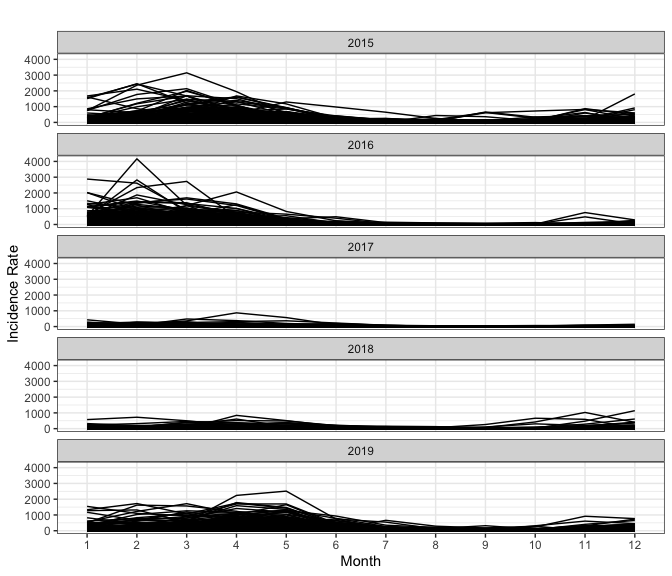
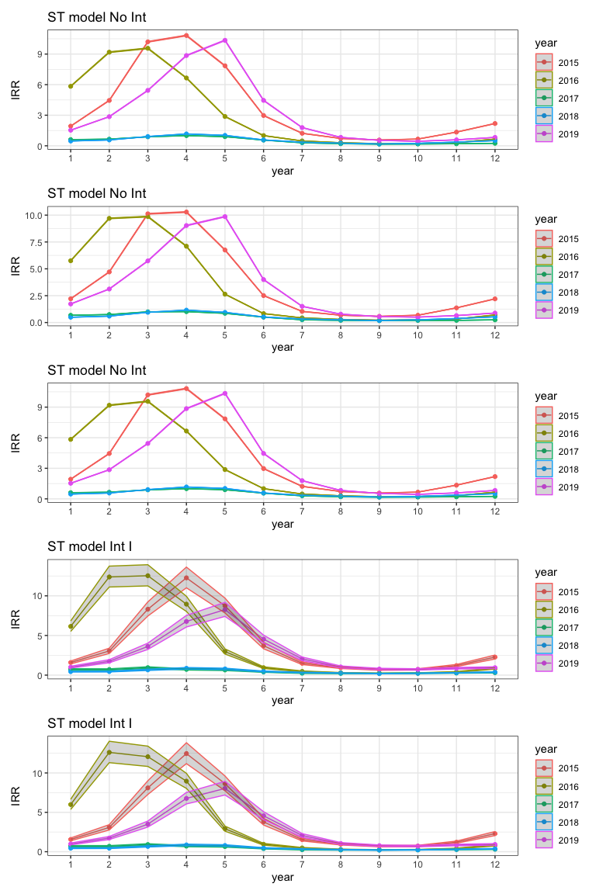
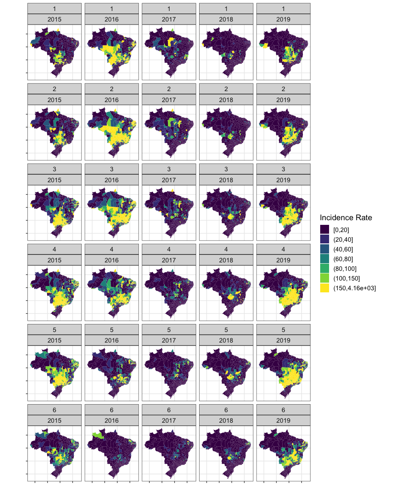
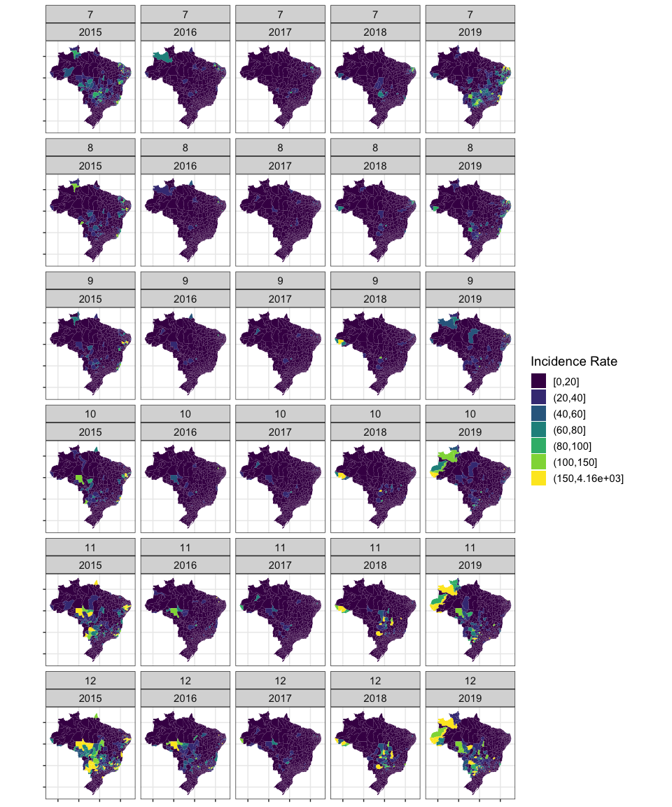
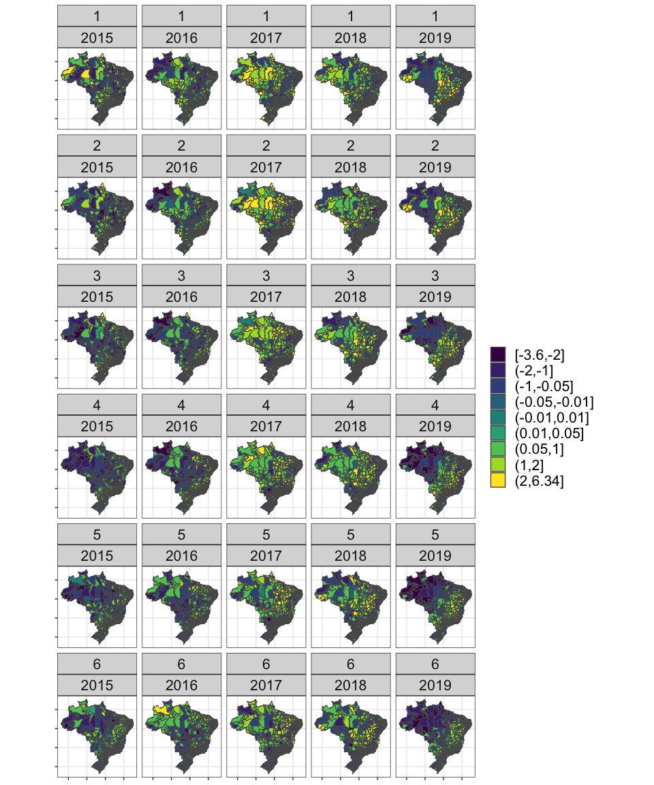
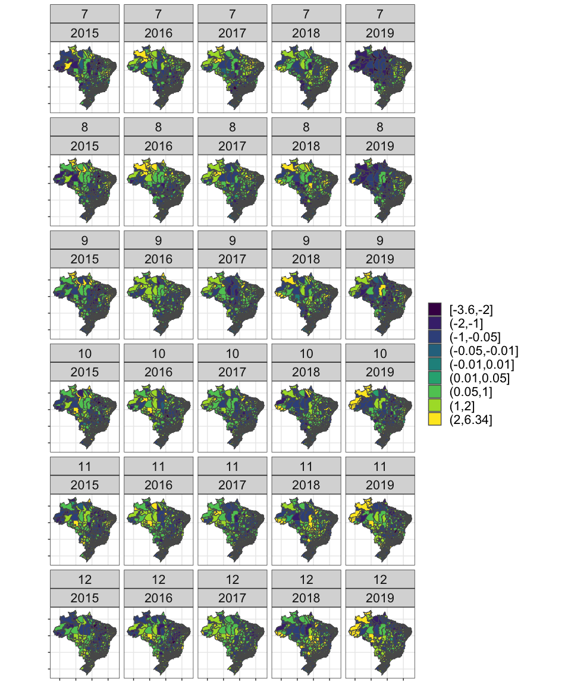
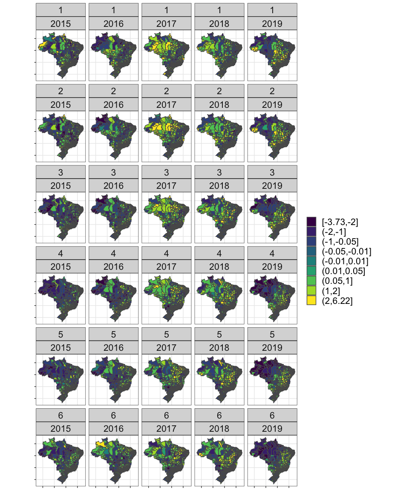
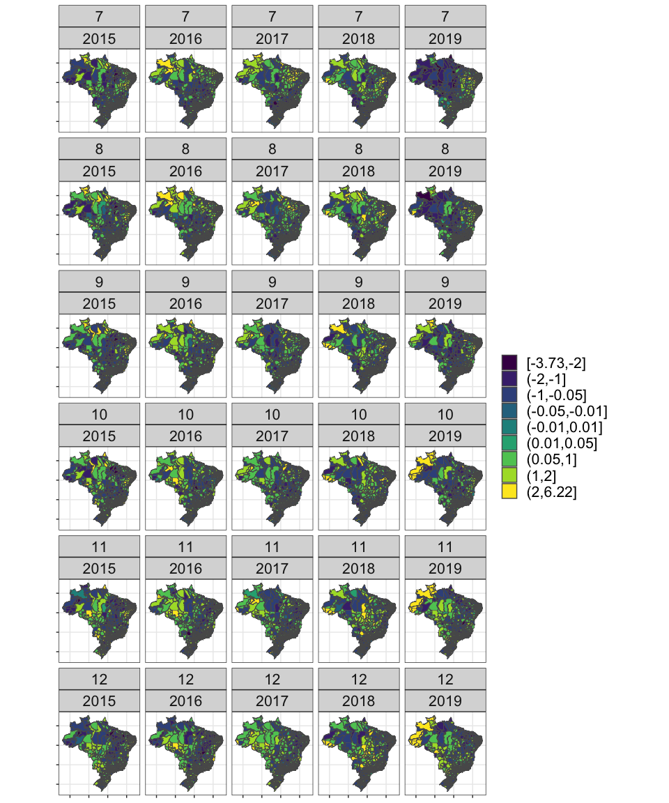

```{=tex}
\pagenumbering{gobble} 
\pagenumbering{arabic}
```
```{r setup, include=FALSE}
knitr::opts_chunk$set(echo = TRUE, message=FALSE, warning=FALSE, fig.align = "center", class.source='klippy')
```

```{r klippy, echo=FALSE, include=TRUE}
klippy::klippy(position = c('top', 'right'),color = 'darkred',
               tooltip_message = 'Click to copy', tooltip_success = 'Done')
```

```{r eval=TRUE, echo=FALSE}
# Load the libraries you will use for the mini-project report
library(dplyr)        
library(sf)           
library(spdep)         
library(tidyr)        
library(INLA)         
library(GGally)
library(ggplot2)      
library(viridis)      
library(patchwork)    
library(scales)
library(knitr)
library(kableExtra)
```

# Introduction
<!-- What dengue is -->
Dengue fever is a viral infection caused by the dengue virus, which is primarily transmitted to humans through the bite of female Aedes mosquito infected with dengue virus serotypes. [@Hasan2016]
<!-- How important it is for brazil? -->
<!-- Why it is important for public health in brazil -->

In Brazil, dengue fever has been a significant public health concern, with the country experiencing large outbreaks and high numbers of cases in recent years.
For example, in 2019, Brazil reported over 1.5 million cases of dengue fever, with hundreds of deaths attributed to the disease.
The prevalence and severity of dengue fever in Brazil are influenced by various factors, including climate conditions.
The situation regarding dengue fever in Brazil can be severe, particularly during outbreaks when healthcare systems may become overwhelmed, and resources are strained. [@traa030]
Therefore, by implementing comprehensive prevention strategies, public health authorities can effectively reduce the impact of dengue fever on individuals, communities, and societies.

<!-- How it relates to the factors we want to study? -->
Dengue fever is considered a climate-sensitive disease because its transmission dynamics are strongly influenced by climatic factors. [@LOWE2011371] [@Lowe2013]
The primary vectors responsible for transmitting the dengue virus have specific temperature and humidity requirements for breeding and survival.
Dengue fever often exhibits seasonal patterns, with higher transmission rates occurring during periods of warmer temperatures and increased rainfall.

<!-- Aim -->
The aim of this research is to conduct a spatial-temporal analysis to investigate relationships between climatic variables and dengue fever incidence over the period of 2015-2019 across different micro regions in Brazil.
<!-- Research gap --> Many existed studies investigate the spatial-temporal relationship using variety of covariates including climatic, demographic, socio-economic, entomologic and geographic predictors.[@Aswi_Cramb_Moraga_Mengersen_2019] [@LOWE2011371]
Two climatic variables, temperature, and precipitation, are the most commonly used predictors.
However, to our best knowledge, there is no other spatial-temporal analysis focused on the same regions during the same period that used both temperature and precipitation predictors.
Therefore, this study will build on top of previous work by including: 1) Comparing some other work using yearly and out-of-date data, we use more up-to-date data with higher granularity (in both spatial and temporal dimensions) 2) Incorporating both monthly maximum temperature and the Palmer's drought severity index (PDSI), a measurement for precipitation, as the climatic variables, we intend to unravel the intricate relationship between environmental factors and the incidence of dengue fever.

<!-- Research questions -->

Through this investigation, the research aims to address a series of research questions in two main folds.
Research questions:

1. What are the spatial and temporal patterns of dengue fever incidence across different microregions in Brazil from 2015 to 2019, and which microregions exhibit consistently higher-than-average incidence rates? Can we build a predictive model to indicate when and where should the authorities implement relevant strategies to prevent dengue fever?

2. How variations in monthly maximum temperature and PDSI influence the dengue fever incidence, controlling the spatial and temporal variability?

By connecting these research questions to the overarching aim, this research endeavours to contribute to a comprehensive understanding of the interplay between climatic factors and dengue fever dynamics, providing insights that may inform targeted interventions and public health strategies in Brazil.


# Methods

For this spatial-temporal ecological study, we utilized Brazilian regional dengue cases and covariate data spanning 557 micro regions over a period of 60 months (12 months for each of five years from 2015 to 2019). The dengue case data were sourced from the Notifiable Diseases Information System, accessible through the Ministry of Health Information Department (DATASUS). These monthly dengue case records provide comprehensive information on reported dengue fever cases across different regions of Brazil. The geographical delineation of the micro regions was established based on a predefined spatial structure provided by the Brazilian Institute of Geography and Statistics (IBGE). All 557 micro regions can be categorised into five larger regions: North, Northeast, Centre West, South and Southeast. Additionally, both maximum temperature and self-calibrated PDSI data were obtained from the Climatic Research Unit. These climatic variables were chosen for their relevance to dengue fever transmission dynamics and their availability for the study period, allowing for a comprehensive assessment of the relationship between climate and dengue incidence in Brazil.

There are five spatial and spatial-temporal model are conducted, which are described in the following equations.
For all models, we employed spatial generalized linear mixed-effect models (GLMM) with a Poisson family and use Bayesian hierarchical framework [@Banerjee2014] to make inference of the posterior distribution of latent parameters by Integrated Nested Laplace Approximation(INLA) [@INLA09].

Model-1 is the spatial-only model which is only an exploratory model to understand the spatial variation of dengue cases and serves as a reference comparison for interpretation purpose.
Then we developed spatial-temporal models with and without interactions.
Model-2.1 and Model-2.2 are the spatial-temporal model without interaction, where the difference between these two models is that Model-2.2 include the two covariates of interets, temperature and PDSI; while Model-3.1 and Model-3.2 are the spatial-temporal model with type I interaction, with the later including covariates as well.
Both covariates are used directly as continuous number.
Since the expected cases in not available, we replace the variable $E$ in the following equation by a scaled population, i.e. $E=Pop/10^5$, which subsequently make $\rho$ being the incident rate of dengue fever per 100,000 population.

$$
\begin{aligned}
&\mathbf{Model-1} \quad& &\mathbf{Model-2.1} \quad& &\mathbf{Model-3.1}\\
O_i &\sim \text{Poisson}(\rho_i E_i) \quad& O_{it} &\sim \text{Poisson}(\rho_{it} E_{it}) \quad& O_{it} &\sim  \text{Poisson}(\rho_{it} E_{it}) \\
\log \rho_i &= b_0 + b_i \quad& \log \rho_{it} &= b_0 + b_i + \gamma_t \quad& \log \rho_{it} &= b_0 + b_i + \gamma_t + \delta_{it} \\
\mathbf{b} &= \frac{1}{\sqrt{\tau_b}}(\sqrt{1-\phi}\mathbf{v}_{*} + \sqrt{\phi}\mathbf{u}_{*}) \quad& \boldsymbol{b} &= \frac{1}{\sqrt{\tau_b}}(\sqrt{1-\phi}\boldsymbol{v}_{*} + \sqrt{\phi}\boldsymbol{u}_{*})  \quad& \boldsymbol{b} &= \frac{1}{\sqrt{\tau_b}}(\sqrt{1-\phi}\boldsymbol{v}_{*} + \sqrt{\phi}\boldsymbol{u}_{*}) \\
&\quad& \gamma_t & \sim \hbox{RW(1)} \quad& \gamma_t  & \sim \hbox{RW(1)} \quad& \\
&\quad& &  & \delta_{it}&\sim  \hbox{Normal}(0, \sigma^2_{\delta}) 
\end{aligned}
$$

$$
\begin{aligned}
&\mathbf{Model-2.2} \quad& &\mathbf{Model-3.2}\\
O_{it} &\sim \text{Poisson}(\rho_{it} E_{it}) \quad& O_{it} &\sim  \text{Poisson}(\rho_{it} E_{it}) \\
\log \rho_{it} &= b_0 + b_i + \gamma_t + \beta_{T} \times Temp_{it} + \beta_{P}  \times PDSI_{it} \quad& \log \rho_{it} &= b_0 + b_i + \gamma_t + \delta_{it} + \beta_{T} \times Temp_{it} + \beta_{P} \times PDSI_{it} \\
\boldsymbol{b} &= \frac{1}{\sqrt{\tau_b}}(\sqrt{1-\phi}\boldsymbol{v}_{*} + \sqrt{\phi}\boldsymbol{u}_{*})  \quad& \boldsymbol{b} &= \frac{1}{\sqrt{\tau_b}}(\sqrt{1-\phi}\boldsymbol{v}_{*} + \sqrt{\phi}\boldsymbol{u}_{*})\\
\gamma_t & \sim \hbox{RW(1)} \quad& \gamma_t  & \sim \hbox{RW(1)} \quad& \\
 &  & \delta_{it}&\sim  \hbox{Normal}(0, \sigma^2_{\delta}) 
\end{aligned}
$$

For area $i$ at time $t$,

-   $O$ stands for the number of observed cases , and $E$ is defined as the population scaled by 100,000,

-   $\rho$ is the incident rate of dengue fever for 100,000,

-   $Temp$ is the month maximum temperature, and $PDSI$ is the Palmer's drought severity index,

-   $\boldsymbol{b}$, the spatial random effect, is specified by a Besag-York-Molli'e (BYM) prior[@Besag1991] composed by $u_i$ and $v_i$, where $u_i$ is the spatially structured component defined by an intrinsic CAR prior [@Iarc2016]: $\boldsymbol{u}\sim ICAR(\boldsymbol{W}, \sigma^2_u)$, and $v_i$ is the unstructured component defined with prior: $v_s \overset{iid}{\sim} \text{Normal}(0,\sigma^2_v)$ ,

-   $\tau_b$ is the precision parameter controlling the marginal variance of the random effect with its prior defined as $P(\sigma_{\tau_b} > 0.5/0.31) = 0.01$, and $\phi$ is the mixing parameter measuring the proportion of the marginal variance with its prior defined as $P(\phi<0/5)=2/3$ [@Riebler2016].

# Results
### Exploratory Data Analysis
Exploratory data analysis is conducted before the statistical models. By aggregating all micro regions data over time, we plotted the variation in the number of dengue cases over the five years. Moreover, in order to understand how temperature and PDSI vary over time, especially to investigate if the years with more severe outbreaks have unusual temperatures and PDSI, we plot the spatial and temporal variation of these two covariates in Figure 1. These plots are interpreted collaboratively with the regional incidence rate plot (shown in Figure 2) to summarise the temperature and PDSI features of regions with higher risk.

### Generalised Linear Mixed Models
For the spatial and spatial-temporal models, we present two types of plots to identify micro regions at higher risk in Figure 3: 1) the plot of posterior mean of incidence rate ratio (IRR) and 2) the plot of posterior probabilities (PP) that the IRR > 1.

### Covariates, Hyperparameters and Model comparison
Then we extracted the posterior median with 95% CI of the IRR of two covariates (in Table 1) and all hyperparameters (in Table 2) respectively. The Watanabe–Akaike information criterion (WAIC) of all five models is shown in Table 3 to provide a comparable measurement evaluating model fit and model complexity. We further visualise the predictive values of each micro regions at each time point to compare the predictive performance of different models.
```{r include=FALSE}
# Load dataset
dengue_2015_2019 <- read.csv("../DS3_DengueBrazil/dengue_2015_2019.csv", header=TRUE)
dengue_2015_2019$year <- as.factor(dengue_2015_2019$year)
dengue_2015_2019$month <- as.factor(dengue_2015_2019$month)

# Compute a spatial-temporal interstion index
dengue_2015_2019$ID_st = seq(1,dim(dengue_2015_2019)[1])

# Compute the number of expected cases
dengue_2015_2019$E  <- dengue_2015_2019$population/10^5
dengue_2015_2019 <- dengue_2015_2019 %>% dplyr::rename(`Dengue Cases` = dengue_cases, Temperature = tmax, PDSI = pdsi) 

# Load shape file
shape_brazil = st_read("../DS3_DengueBrazil/shape_brazil.shp")
# Remove island FERNANDO DE NORONHA
shape_brazil = shape_brazil[shape_brazil$code != 26019,] 

# Cerate full data map
map_dengue_2015_2019 = left_join(shape_brazil, dengue_2015_2019, by = c("code" = "micro_code"))
map_dengue_2015_2019$year_month <- paste(map_dengue_2015_2019$year, map_dengue_2015_2019$month, sep = "_")

# Compute neighbor
shape_brazil_nb = poly2nb(shape_brazil, snap=1000, queen=TRUE)
summary(shape_brazil_nb)

# Create adjacency matrix 
nb2INLA("../DS3_DengueBrazil/shape_brazil.graph",shape_brazil_nb)
shape_brazil.adj = "../DS3_DengueBrazil/shape_brazil.graph"
```

```{r include=FALSE}
# Compute aggregated data over area or time
# Area - aggregation
dengue_2015_2019_agg_area <- dengue_2015_2019 %>%
  group_by(ID_space, micro_code, micro_name, region_name) %>%
  summarise(observed = sum(`Dengue Cases`), 
            expected=sum(E), 
            population=sum(population),
            Temperature = mean(Temperature),
            PDSI = mean(PDSI)
            ) %>%
  dplyr::rename(O = observed, E = expected) 

# Time - aggregation - Monthly
dengue_2015_2019_agg_time <- dengue_2015_2019 %>%
  group_by(ID_time, year, month) %>%
  summarise(observed = sum(`Dengue Cases`), 
            expected=sum(E),
            Temperature = mean(Temperature),
            PDSI = mean(PDSI)
            ) %>%
  dplyr::rename(O = observed, E = expected) 

# Time - aggregation - Yearly
dengue_2015_2019_agg_year <- dengue_2015_2019 %>%
  group_by(year) %>%
  summarise(observed = sum(`Dengue Cases`), 
            expected=sum(E),
            Temperature = mean(Temperature),
            PDSI = mean(PDSI)
  ) %>%
  dplyr::rename(O = observed, E = expected) 

# Merge area data with shape file
map_dengue_2015_2019_agg_area = left_join(shape_brazil, dengue_2015_2019_agg_area, by = c("code" = "micro_code"))

```

```{r include=FALSE}
# Generate a series of plots for EDA
# Plot total number of cases over 12 month for each year
p_cases_over_time <- ggplot(dengue_2015_2019_agg_time, 
       aes(x = month, y = O, group = year, color = year)) +
  theme_bw() + 
  geom_line() +
  geom_point() +
  labs(x = "Month", y = "Dengue Cases") +
  ggtitle("Dengue Cases Over 12 months")

# Plot total number of cases over five year
p_cases_over_year <- ggplot(dengue_2015_2019_agg_year, 
                            aes(x = year, y = O, group = 1)) +
  theme_bw() + 
  geom_line() +
  geom_point() +
  labs(x = "Month", y = "Dengue Cases") +
  ggtitle("Dengue Cases Over Years")

# Plot temperature variation over time
p_Temperature_over_time <- ggplot(dengue_2015_2019_agg_time, 
                          aes(x = month, y = Temperature, group = year, color = year)) +
  theme_bw() + 
  geom_line() +
  geom_point() +
  labs(x = "Month", y = "Mean Temperature") +
  ggtitle("Average of Monthly Maximum Temperature")

# Plot PDSI variation over time
p_PDSI_over_time <- ggplot(dengue_2015_2019_agg_time, 
                         aes(x = month, y = PDSI, group = year, color = year)) +
  theme_bw() + 
  geom_line() +
  geom_point() +
  labs(x = "Month", y = "Mean PDSI") +
  ggtitle("Palmer's drought severity index (PDSI)")

# Plot temperature variation over area
p_Temperature_over_area <- ggplot() + 
  geom_sf(data = map_dengue_2015_2019_agg_area, col = NA) + aes(fill = Temperature) +
  theme_void() + 
  scale_fill_viridis_c() + 
  #guides(fill=guide_legend(title="Incident Rate")) + 
  theme(axis.text.x = element_blank(), 
        axis.text.y = element_blank()) #+ ggtitle("Monthly Maximum Temperature")

# Plot PDSI variation over area
p_PDSI_over_area <- ggplot() + 
  geom_sf(data = map_dengue_2015_2019_agg_area, col = NA) + aes(fill = PDSI) +
  theme_void() + 
  scale_fill_viridis_c(option = "plasma") + 
  #guides(fill=guide_legend(title="Incident Rate")) + 
  theme(axis.text.x = element_blank(), 
        axis.text.y = element_blank()) #+ ggtitle("Palmer's drought severity index (PDSI)")

```

```{r, eval=TRUE, echo=FALSE, fig.height=4, fig.width=10, fig.cap="Figure 1. (Left-up) Plot of monthly variation of the number cases between 2015 and 2019. (Left-bottom) Plot of yearly variation of the total number of cases. (Middle-up) Plot of monthly average of monthly maximum temperature for the five years. (Middle-bottom) Plot of the monthly average of PDSI for the five years. (Right-up) Map of average of monthly maximum temperature. (Right-bottom) Map of average PDSI"}
# , fig.cap="Figure 1. (Left) This is the number "
(p_cases_over_time / p_cases_over_year) |
  (p_Temperature_over_time / p_PDSI_over_time) | 
  (p_Temperature_over_area / p_PDSI_over_area)
```
```{r include=FALSE}
# compute IR for aggreation data over area
# this is actually how many cases per 100,000 people
dengue_2015_2019_agg_area = dengue_2015_2019_agg_area %>% mutate(IR = O/E) 

plot(density(dengue_2015_2019_agg_area$IR))

dengue_2015_2019_agg_area$IRcat = cut(dengue_2015_2019_agg_area$IR, 
                          breaks=c(#min(dengue_2015_2019_agg_area$IR), 
                                   0, 20, 40, 60, 80, 100, 150,
                                   max(dengue_2015_2019_agg_area$IR)), include.lowest = T)

map_IR_space = left_join(shape_brazil, dengue_2015_2019_agg_area, by = c("code" = "micro_code"))

# compute IR by area - aggregated
map_IR_space_cw <- map_IR_space[map_IR_space$region_name == 'Centre-West',]
map_IR_space_n <- map_IR_space[map_IR_space$region_name == 'North',]
map_IR_space_ne <- map_IR_space[map_IR_space$region_name == 'Northeast',]
map_IR_space_s <- map_IR_space[map_IR_space$region_name == 'South',]
map_IR_space_se <- map_IR_space[map_IR_space$region_name == 'Southeast',]

# plot IR all
p_IR_all <- ggplot() + 
  geom_sf(data = map_IR_space, col = NA, show.legend = F) + aes(fill = IRcat) +
  theme_void() + 
  scale_fill_viridis_d(limits = c("[0,20]","(20,40]","(40,60]","(60,80]","(80,100]","(100,150]","(150,235]")) + 
  #guides(fill=guide_legend(title="Incident Rate")) + 
  theme(text = element_text(size=12), 
        axis.text.x = element_blank(), 
        axis.text.y = element_blank(),
        plot.title = element_text(hjust = 0.5,face = "bold")) + 
  ggtitle("Brazil Dengue Disease Incidence Rate\nper 100,000 population")

# plot IR by area - aggregated
p_IR_cw <- ggplot() + 
  geom_sf(data = map_IR_space_cw, col = NA, show.legend = F) + aes(fill = IRcat) +
  theme_void() + 
  scale_fill_viridis_d(limits = c("[0,20]","(20,40]","(40,60]","(60,80]","(80,100]","(100,150]","(150,235]")) + 
  #guides(fill=guide_legend(title="")) + 
  theme(text = element_text(size=10), 
        axis.text.x = element_blank(), 
        axis.text.y = element_blank(),
        plot.title = element_text(hjust = 0.5,face = "bold")) +
  ggtitle("Centre-West")

p_IR_n <- ggplot() + 
  geom_sf(data = map_IR_space_n, col = NA, show.legend = F) + aes(fill = IRcat) +
  theme_void() + 
  scale_fill_viridis_d(limits = c("[0,20]","(20,40]","(40,60]","(60,80]","(80,100]","(100,150]","(150,235]")) + 
  #guides(fill=guide_legend(title="")) + 
  theme(text = element_text(size=10), 
        axis.text.x = element_blank(), 
        axis.text.y = element_blank(),
        plot.title = element_text(hjust = 0.5,face = "bold")) +
  ggtitle("North")

p_IR_ne <- ggplot() + 
  geom_sf(data = map_IR_space_ne, col = NA, show.legend = TRUE) + aes(fill = IRcat) +
  theme_void() + 
  scale_fill_viridis_d(limits = c("[0,20]","(20,40]","(40,60]","(60,80]","(80,100]","(100,150]","(150,235]")) + 
  guides(fill=guide_legend(title="Incident Rate\n per 100,000 population")) + 
  theme(text = element_text(size=10), 
        legend.title =element_text(size=10),
        legend.text = element_text(size=10),
        axis.text.x = element_blank(), 
        axis.text.y = element_blank(),
        plot.title = element_text(hjust = 0.5,face = "bold")) +
  ggtitle("Northeast")

p_IR_s <- ggplot() + 
  geom_sf(data = map_IR_space_s, col = NA, show.legend = F) + aes(fill = IRcat) +
  theme_void() + 
  scale_fill_viridis_d(limits = c("[0,20]","(20,40]","(40,60]","(60,80]","(80,100]","(100,150]","(150,235]")) + 
  #guides(fill=guide_legend(title="South")) + 
  theme(text = element_text(size=10), 
        axis.text.x = element_blank(), 
        axis.text.y = element_blank(),
        plot.title = element_text(hjust = 0.5,face = "bold")) +
  ggtitle("South")

p_IR_se <- ggplot() + 
  geom_sf(data = map_IR_space_se, col = NA, show.legend = F) + aes(fill = IRcat) +
  theme_void() + 
  scale_fill_viridis_d(limits = c("[0,20]","(20,40]","(40,60]","(60,80]","(80,100]","(100,150]","(150,235]")) + 
  #guides(fill=guide_legend(title="")) + 
  theme(text = element_text(size=10), 
        axis.text.x = element_blank(), 
        axis.text.y = element_blank(),
        plot.title = element_text(hjust = 0.5,face = "bold")) +
  ggtitle("Southeast")
```

```{r, eval=TRUE, echo=FALSE, fig.height=2.2, fig.width=8, fig.cap="Figure 2. Brazil dengue disease incidence rate per 100,000 population."}
(p_IR_cw|p_IR_se|p_IR_s|p_IR_n|p_IR_ne)
#p_IR_all|((p_IR_n|p_IR_ne)/(p_IR_cw|p_IR_se|p_IR_s))
```
```{r include=FALSE}
# Specify the formula
formula_BYM2 = O ~ f(ID_space, model="bym2", graph=shape_brazil.adj,
                     hyper=list(prec = list(prior = "pc.prec",param = c(0.5 / 0.31, 0.01)),
                                phi = list(prior = "pc",param = c(0.5, 2 / 3))
                     ))
# Run INLA model
sBYM.model.poisson = inla(formula=formula_BYM2, 
                  family="poisson", 
                  data=dengue_2015_2019_agg_area, 
                  #E=E, 
                  offset=log(E), 
                  control.compute=list(waic=TRUE))

#Relative risks
IRR_sBYM = c()

for(i in 1:557){
  IRR_sBYM[i] = inla.emarginal(function(x) exp(x), 
                              sBYM.model.poisson$marginals.random$ID_space[[i]])
}

#Posterior probabilities
IRR_sBYM_marg = sBYM.model.poisson$marginals.random$ID_space[1:557]
PP_sBYM = lapply(IRR_sBYM_marg, function(x) {1-inla.pmarginal(0,x)})

#Combine IRR and PP results
resIRR_PP = data.frame(resIRR=IRR_sBYM, 
                      PP=unlist(PP_sBYM),
                      code=dengue_2015_2019_agg_area[,'micro_code']) # micro region code

# plot(density(resIRR_PP$resIRR))

resIRR_PP$resIRRcat = cut(resIRR_PP$resIRR, breaks=c(min(resIRR_PP$resIRR), 
                                                 0.5, 1, 2, 3, 4, 5, 6, 7, 8, 9,
                                                 max(resIRR_PP$resIRR)),include.lowest = T)

resIRR_PP$PPcat = cut(resIRR_PP$PP, c(0, 0.2, 0.8, 1.00), include.lowest = TRUE)

map_IRR_PP = left_join(shape_brazil, resIRR_PP, by = c("code" = "micro_code"))

# plot
p_IRR = ggplot() + geom_sf(data = map_IRR_PP) + aes(fill = resIRRcat) +
  theme_bw() + scale_fill_brewer(palette = "PuOr") + 
  guides(fill=guide_legend(title="IRR")) + ggtitle("IRR Spatial model") + 
  theme(text = element_text(), 
        axis.text.x = element_blank(), 
        axis.text.y = element_blank(), plot.title = element_text(size = 10, face = "bold"))

p_PP = ggplot() + geom_sf(data = map_IRR_PP) + aes(fill = PPcat) +
  theme_bw() +
  scale_fill_viridis(
    option = "plasma", name="PP",
    discrete = T,
    direction = -1,
    guide = guide_legend(
      title.position = 'top',
      reverse = T
    )) +  ggtitle("PP Spatial model") + theme(text = element_text(), 
                                              axis.text.x = element_blank(), 
                                              axis.text.y = element_blank(), plot.title = element_text(size = 10, face = "bold")) 

```

```{r include=FALSE}
# ST Model no Int - no Covariates
dengue_2015_2019 <- dengue_2015_2019 %>% dplyr::rename(O = `Dengue Cases`)
# Specify the formula
formula_ST_noint = O ~ 
  f(ID_space, model="bym2", graph=shape_brazil.adj,
    hyper=list(
      prec = list(prior = "pc.prec",param = c(0.5 / 0.31, 0.01)),
      phi = list(prior = "pc",param = c(0.5, 2 / 3))
    )
  ) + 
  f(ID_time,model="rw1", 
    hyper=list(
      prec = list(
        prior = "pc.prec",
        param = c(0.5 / 0.31, 0.01))
    )
  )
# Run INLA model
stBYM.model = inla(formula=formula_ST_noint, 
                   family="poisson", 
                   data=dengue_2015_2019, 
                   #E=E, 
                   offset=log(E),  
                   control.compute=list(waic=TRUE))

#Spatial Relative risks
IRR_stBYM = c()

for(i in 1:557){
  IRR_stBYM[i] = inla.emarginal(function(x) exp(x), stBYM.model$marginals.random$ID_space[[i]])
}

#Posterior probabilities (for spatial IRR)
IRR_stBYM_marg = stBYM.model$marginals.random$ID_space[1:557]
PP_stBYM = lapply(IRR_stBYM_marg, function(x) {1-inla.pmarginal(0,x)})

#Temporal Relative risks and CI95
IRR_stRW_IRR = c()
IRR_stRW_lo = c()
IRR_stRW_hi = c()

for(i in 1:60){
  #Posterior mean
  IRR_stRW_IRR[i] = inla.emarginal(function(x) exp(x), stBYM.model$marginals.random$ID_time[[i]])
  #2.5% quantile 
  IRR_stRW_lo[i] = inla.qmarginal(0.025,inla.tmarginal(function(x) exp(x), stBYM.model$marginals.random$ID_time[[i]]))
  #97.5% quantile 
  IRR_stRW_hi[i] = inla.qmarginal(0.975, inla.tmarginal(function(x) exp(x), stBYM.model$marginals.random$ID_time[[i]]))
}

IRR_stRW = data.frame(IRR=IRR_stRW_IRR,low=IRR_stRW_lo,high=IRR_stRW_hi)
IRR_stRW = cbind(dengue_2015_2019_agg_time[,c('year','month')],IRR_stRW)

# plot time part
Temp_st = ggplot(IRR_stRW, aes(x = month, y = IRR, group = year, color = year)) + 
  theme_bw() +
  geom_line() +
  geom_point() + 
  ggtitle("ST model No Int") + 
  geom_ribbon(aes(ymin=low,ymax=high), alpha=0.2) + 
  labs(x="year")

resIRR_PP_st = data.frame(resIRR=IRR_stBYM, 
                         PP=unlist(PP_stBYM),
                         code=dengue_2015_2019[,'micro_code'])

# breakpoints
resIRR_PP_st$resIRRcat = cut(resIRR_PP_st$resIRR, breaks=c(min(resIRR_PP_st$resIRR), 
                                                       0.5, 1, 2, 3, 4, 5, 6, 7, 8, 9,
                                                       max(resIRR_PP_st$resIRR)),include.lowest = T)

resIRR_PP_st$PPcat = cut(resIRR_PP_st$PP, c(0, 0.2, 0.8, 1.00), include.lowest = TRUE)

map_IRR_ST = left_join(shape_brazil, resIRR_PP_st, by = c("code" = "code"))


p_IRR_st = ggplot() + geom_sf(data = map_IRR_ST) + aes(fill = resIRRcat) +
  theme_bw() + scale_fill_brewer(palette = "PuOr") + 
  guides(fill=guide_legend(title="IRR")) +  ggtitle("IRR ST model") +
  theme(text = element_text(), 
        axis.text.x = element_blank(), 
        axis.text.y = element_blank(), plot.title = element_text(size = 10, face = "bold")) 

p_PP_st = ggplot() + geom_sf(data = map_IRR_ST) + aes(fill = PPcat) +
  theme_bw() +
  scale_fill_viridis(
    option = "plasma",
    name = "PP ST model",
    discrete = T,
    direction = -1,
    guide = guide_legend(
      title.position = 'top',
      reverse = T
    )) +  ggtitle("PP ST model") + theme(text = element_text(), 
                                         axis.text.x = element_blank(), 
                                         axis.text.y = element_blank(), plot.title = element_text(size = 10, face = "bold"))

```

```{r include=FALSE}
# ST Model no Int - no Covariates
# Specify the formula
formula_ST_noint_cov = O ~ Temperature + 
  PDSI + 
  f(ID_space, model="bym2", graph=shape_brazil.adj,
    hyper=list(
      prec = list(prior = "pc.prec",param = c(0.5 / 0.31, 0.01)),
      phi = list(prior = "pc",param = c(0.5, 2 / 3))
    )
  ) + 
  f(ID_time,model="rw1", 
    hyper=list(
      prec = list(
        prior = "pc.prec",
        param = c(0.5 / 0.31, 0.01))
    )
  )
# Run INLA model
stBYM.model_cov = inla(formula=formula_ST_noint_cov, 
                   family="poisson", 
                   data=dengue_2015_2019, 
                   #E=E, 
                   offset=log(E),  
                   control.compute=list(waic=TRUE))

#Spatial Relative risks
IRR_stBYM_cov = c()

for(i in 1:557){
  IRR_stBYM_cov[i] = inla.emarginal(function(x) exp(x), stBYM.model_cov$marginals.random$ID_space[[i]])
}

#Posterior probabilities (for spatial IRR)
IRR_stBYM_cov_marg = stBYM.model_cov$marginals.random$ID_space[1:557]
PP_stBYM_cov = lapply(IRR_stBYM_cov_marg, function(x) {1-inla.pmarginal(0,x)})

#Temporal Relative risks and CI95
IRR_stRW_cov_IRR = c()
IRR_stRW_cov_lo = c()
IRR_stRW_cov_hi = c()

for(i in 1:60){
  #Posterior mean
  IRR_stRW_cov_IRR[i] = inla.emarginal(function(x) exp(x), stBYM.model_cov$marginals.random$ID_time[[i]])
  #2.5% quantile 
  IRR_stRW_cov_lo[i] = inla.qmarginal(0.025,inla.tmarginal(function(x) exp(x), stBYM.model_cov$marginals.random$ID_time[[i]]))
  #97.5% quantile 
  IRR_stRW_cov_hi[i] = inla.qmarginal(0.975, inla.tmarginal(function(x) exp(x), stBYM.model_cov$marginals.random$ID_time[[i]]))
}

IRR_stRW_cov = data.frame(IRR=IRR_stRW_cov_IRR,low=IRR_stRW_cov_lo,high=IRR_stRW_cov_hi)
IRR_stRW_cov = cbind(dengue_2015_2019_agg_time[,c('year','month')],IRR_stRW_cov)

# plot time part
Temp_st_cov= ggplot(IRR_stRW_cov, aes(x = month, y = IRR, group = year, color = year)) + 
  theme_bw() +
  geom_line() +
  geom_point() + 
  ggtitle("ST model No Int") + 
  geom_ribbon(aes(ymin=low,ymax=high), alpha=0.2) + 
  labs(x="year")

resIRR_PP_st_cov = data.frame(resIRR=IRR_stBYM_cov, 
                          PP=unlist(PP_stBYM_cov),
                          code=dengue_2015_2019[,'micro_code'])

# breakpoints
resIRR_PP_st_cov$resIRRcat = cut(resIRR_PP_st_cov$resIRR, breaks=c(min(resIRR_PP_st_cov$resIRR), 
                                                           0.5, 1, 2, 3, 4, 5, 6, 7, 8, 9,
                                                           max(resIRR_PP_st_cov$resIRR)),include.lowest = T)

resIRR_PP_st_cov$PPcat = cut(resIRR_PP_st_cov$PP, c(0, 0.2, 0.8, 1.00), include.lowest = TRUE)

map_IRR_ST_cov = left_join(shape_brazil, resIRR_PP_st_cov, by = c("code" = "code"))

p_IRR_st_cov = ggplot() + geom_sf(data = map_IRR_ST_cov) + aes(fill = resIRRcat) +
  theme_bw() + scale_fill_brewer(palette = "PuOr") + 
  guides(fill=guide_legend(title="IRR")) +  ggtitle("IRR ST model with covariates") +
  theme(text = element_text(), 
        axis.text.x = element_blank(), 
        axis.text.y = element_blank(), plot.title = element_text(size = 10, face = "bold")) 

p_PP_st_cov = ggplot() + geom_sf(data = map_IRR_ST_cov) + aes(fill = PPcat) +
  theme_bw() +
  scale_fill_viridis(
    option = "plasma",
    name = "PP ST model",
    discrete = T,
    direction = -1,
    guide = guide_legend(
      title.position = 'top',
      reverse = T)) +  
  ggtitle("PP ST model with covariates") + 
  theme(text = element_text(), 
        axis.text.x = element_blank(), 
        axis.text.y = element_blank(), 
        plot.title = element_text(size = 10, face = "bold"))
```

```{r, eval=TRUE, echo=FALSE, fig.height=6, fig.width=12}
(p_IRR/p_PP) |(p_IRR_st/p_PP_st) | (p_IRR_st_cov/p_PP_st_cov) 
  
```
```{r include=FALSE}
# ST Model with Int type I - no Covariates
# Specify the formula
formula_ST_intI = O ~ 
  f(ID_space, model="bym2", graph=shape_brazil.adj, hyper=list(prec = list(
    prior = "pc.prec",
    param = c(0.5 / 0.31, 0.01)),
    phi = list(
      prior = "pc",
      param = c(0.5, 2 / 3)))) + 
  f(ID_time,model="rw1", hyper=list(prec = list(
    prior = "pc.prec",
    param = c(0.5 / 0.31, 0.01))))+
  f(ID_st,model="iid", hyper=list(prec = list(
    prior = "pc.prec",
    param = c(0.5 / 0.31, 0.01))))

# Run INLA model
stIntI.BYM.model = inla(formula=formula_ST_intI, 
                        family="poisson", 
                        data=dengue_2015_2019, 
                        #E=E, 
                        offset=log(E),
                        control.compute=list(waic=TRUE))

#Spatial Relative risks
IRR_stIntI.BYM = c()

for(i in 1:557){
  IRR_stIntI.BYM[i] = inla.emarginal(function(x) exp(x), 
                                    stIntI.BYM.model$marginals.random$ID_space[[i]])
}

#Posterior probabilities (for spatial IRR)
IRR_stIntI.BYM_marg = stIntI.BYM.model$marginals.random$ID_space[1:557]
PP_stIntI.BYM = lapply(IRR_stIntI.BYM_marg, function(x) {1-inla.pmarginal(0,x)})

#Temporal Relative risks and CI95
IRR_stIntI.RW_IRR = c()
IRR_stIntI.RW_lo = c()
IRR_stIntI.RW_hi = c()

for(i in 1:60){
  #Posterior mean
  IRR_stIntI.RW_IRR[i] = inla.emarginal(function(x) exp(x), 
                                      stIntI.BYM.model$marginals.random$ID_time[[i]])
  #2.5% quantile 
  IRR_stIntI.RW_lo[i] = inla.qmarginal(0.025,inla.tmarginal(function(x) exp(x), stIntI.BYM.model$marginals.random$ID_time[[i]]))
  #97.5% quantile 
  IRR_stIntI.RW_hi[i] = inla.qmarginal(0.975, inla.tmarginal(function(x) exp(x), stIntI.BYM.model$marginals.random$ID_time[[i]]))
}

IRR_stIntI.RW = data.frame(IRR=IRR_stIntI.RW_IRR,low=IRR_stIntI.RW_lo,high=IRR_stIntI.RW_hi)
IRR_stIntI.RW = cbind(dengue_2015_2019_agg_time[,c('year','month')],IRR_stIntI.RW)

# time
Temp_stIntI = ggplot(IRR_stIntI.RW, aes(x = month, y = IRR, group = year, color = year)) + 
  theme_bw() +
  geom_line() + 
  geom_point() + 
  ggtitle("ST model Int I") + 
  geom_ribbon(aes(ymin=low,ymax=high), alpha=0.2) + 
  labs(x="year")

resIRR_PP_stIntI = data.frame(resIRR=IRR_stIntI.BYM, 
                             PP=unlist(PP_stIntI.BYM),
                             code=dengue_2015_2019[,'micro_code'])
# breakpoints
resIRR_PP_stIntI$resIRRcat = cut(resIRR_PP_stIntI$resIRR, breaks=c(min(resIRR_PP_stIntI$resIRR), 
                                                               0.5, 1, 2, 3, 4, 5, 6, 7, 8, 9, 
                                                               max(resIRR_PP_stIntI$resIRR)),include.lowest = T)

resIRR_PP_stIntI$PPcat = cut(resIRR_PP_stIntI$PP, c(0, 0.2, 0.8, 1.00), include.lowest = TRUE)

map_IRR_ST.IntI = left_join(shape_brazil, resIRR_PP_stIntI, by = c("code" = "code"))

# space
p_IRR_stIntI = ggplot() + geom_sf(data = map_IRR_ST.IntI) + aes(fill = resIRRcat) +
  theme_bw() + scale_fill_brewer(palette = "PuOr") + 
  guides(fill=guide_legend(title="IRR")) +  ggtitle("IRR ST model Int I") +
  theme(text = element_text(), 
        axis.text.x = element_blank(), 
        axis.text.y = element_blank(), plot.title = element_text(size = 10, face = "bold")) 

p_PP_stIntI = ggplot() + geom_sf(data = map_IRR_ST.IntI) + aes(fill = PPcat) +
  theme_bw() +
  scale_fill_viridis(
    option = "plasma",
    name = "PP ST model Int I",
    discrete = T,
    direction = -1,
    guide = guide_legend(
      title.position = 'top',
      reverse = T
    )) +  ggtitle("PP ST model Int I") + theme(text = element_text(), 
                                               axis.text.x = element_blank(), 
                                               axis.text.y = element_blank(), plot.title = element_text(size = 10, face = "bold"))

```

```{r include=FALSE}
# ST Model with Int type I - with Covariates
# Specify the formula
formula_ST_intI_cov = O ~ Temperature + 
  PDSI + 
  f(ID_space, model="bym2", graph=shape_brazil.adj, hyper=list(prec = list(
    prior = "pc.prec",
    param = c(0.5 / 0.31, 0.01)),
    phi = list(
      prior = "pc",
      param = c(0.5, 2 / 3)))) + 
  f(ID_time,model="rw1", hyper=list(prec = list(
    prior = "pc.prec",
    param = c(0.5 / 0.31, 0.01))))+
  f(ID_st,model="iid", hyper=list(prec = list(
    prior = "pc.prec",
    param = c(0.5 / 0.31, 0.01))))

# Run INLA model
stIntI.BYM.model_cov = inla(formula=formula_ST_intI_cov, 
                            family="poisson", 
                            data=dengue_2015_2019, 
                            #E=E, 
                            offset=log(E),
                            control.compute=list(waic=TRUE))

#Spatial Relative risks
IRR_stIntI.BYM_cov = c()

for(i in 1:557){
  IRR_stIntI.BYM_cov[i] = inla.emarginal(function(x) exp(x), 
                                         stIntI.BYM.model_cov$marginals.random$ID_space[[i]])
}

#Posterior probabilities (for spatial IRR)
IRR_stIntI.BYM_cov_marg = stIntI.BYM.model_cov$marginals.random$ID_space[1:557]
PP_stIntI.BYM_cov = lapply(IRR_stIntI.BYM_cov_marg, function(x) {1-inla.pmarginal(0,x)})

#Temporal Relative risks and CI95
IRR_stIntI.RW_cov_IRR = c()
IRR_stIntI.RW_cov_lo = c()
IRR_stIntI.RW_cov_hi = c()

for(i in 1:60){
  #Posterior mean
  IRR_stIntI.RW_cov_IRR[i] = inla.emarginal(function(x) exp(x), 
                                            stIntI.BYM.model_cov$marginals.random$ID_time[[i]])
  #2.5% quantile 
  IRR_stIntI.RW_cov_lo[i] = inla.qmarginal(0.025,inla.tmarginal(function(x) exp(x), stIntI.BYM.model_cov$marginals.random$ID_time[[i]]))
  #97.5% quantile 
  IRR_stIntI.RW_cov_hi[i] = inla.qmarginal(0.975, inla.tmarginal(function(x) exp(x), stIntI.BYM.model_cov$marginals.random$ID_time[[i]]))
}

IRR_stIntI.RW_cov = data.frame(IRR=IRR_stIntI.RW_cov_IRR,low=IRR_stIntI.RW_cov_lo,high=IRR_stIntI.RW_cov_hi)
IRR_stIntI.RW_cov = cbind(dengue_2015_2019_agg_time[,c('year','month')],IRR_stIntI.RW_cov)

# time
Temp_stIntI_cov = ggplot(IRR_stIntI.RW_cov, aes(x = month, y = IRR, group = year, color = year)) + 
  theme_bw() +
  geom_line() + 
  geom_point() + 
  ggtitle("ST model Int I") + 
  geom_ribbon(aes(ymin=low,ymax=high), alpha=0.2) + 
  labs(x="year")

resIRR_PP_stIntI_cov = data.frame(resIRR=IRR_stIntI.BYM_cov, 
                                  PP=unlist(PP_stIntI.BYM_cov),
                                  code=dengue_2015_2019[,'micro_code'])
# breakpoints
resIRR_PP_stIntI_cov$resIRRcat = cut(resIRR_PP_stIntI_cov$resIRR, breaks=c(min(resIRR_PP_stIntI_cov$resIRR), 
                                                                           0.5, 1, 2, 3, 4, 5, 6, 7, 8, 9, 
                                                                           max(resIRR_PP_stIntI_cov$resIRR)),include.lowest = T)

resIRR_PP_stIntI_cov$PPcat = cut(resIRR_PP_stIntI_cov$PP, c(0, 0.2, 0.8, 1.00), include.lowest = TRUE)

map_IRR_ST.IntI_cov = left_join(shape_brazil, resIRR_PP_stIntI_cov, by = c("code" = "code"))

# space
p_IRR_stIntI_cov = ggplot() + geom_sf(data = map_IRR_ST.IntI_cov) + aes(fill = resIRRcat) +
  theme_bw() + scale_fill_brewer(palette = "PuOr") +  
  guides(fill=guide_legend(title="IRR")) +  ggtitle("IRR ST model Int I with covariates") +
  theme(text = element_text(), 
        axis.text.x = element_blank(), 
        axis.text.y = element_blank(), plot.title = element_text(size = 10, face = "bold")) 

p_PP_stIntI_cov = ggplot() + geom_sf(data = map_IRR_ST.IntI_cov) + aes(fill = PPcat) +
  theme_bw() +
  scale_fill_viridis(
    option = "plasma",
    name = "PP ST model Int I",
    discrete = T,
    direction = -1,
    guide = guide_legend(
      title.position = 'top',
      reverse = T
    )) +  ggtitle("PP ST model Int I with covariates") + theme(text = element_text(), 
                                               axis.text.x = element_blank(), 
                                               axis.text.y = element_blank(), plot.title = element_text(size = 10, face = "bold"))


```

```{r, eval=TRUE, echo=FALSE, fig.height=6, fig.width=12, fig.cap="Figure 3. (Left) Map of posterior mean of incidence rate ratio of each model. (Right) map of posterior probabilities (PP) that the IRR > 1"}
(p_IRR_stIntI/p_PP_stIntI) | 
(p_IRR_stIntI_cov/p_PP_stIntI_cov)
```
```{r include=FALSE}
# Extract the mean of the coeffecient of interaction term
dengue_2015_2019$intI = stIntI.BYM.model$summary.random$ID_st$mean
dengue_2015_2019$intI_cov = stIntI.BYM.model_cov$summary.random$ID_st$mean

# set break point
dengue_2015_2019$intI_cat = cut(dengue_2015_2019$intI,  
                                breaks=c(min(dengue_2015_2019$intI),
                                  -2, -1,-0.05, -0.01, 0.01, 0.05, 1, 2,
                                  max(dengue_2015_2019$intI)),include.lowest = T)

dengue_2015_2019$intI_cov_cat = cut(dengue_2015_2019$intI_cov,  
                                breaks=c(min(dengue_2015_2019$intI_cov),
                                         -2, -1,-0.05, -0.01, 0.01, 0.05, 1, 2,
                                         max(dengue_2015_2019$intI_cov)),include.lowest = T)
# Merge with shape file
map_dengue_2015_2019 = left_join(shape_brazil, dengue_2015_2019, by = c("code" = "micro_code"))

```

```{r include=FALSE}
stBYM_cov.coef = 
  round(
    data.frame(median = exp(stBYM.model_cov[["summary.fixed"]][2:3,1]),
               LL = exp(stBYM.model_cov[["summary.fixed"]][2:3,3]), 
               UL = exp(stBYM.model_cov[["summary.fixed"]][2:3,5])),
    digits = 3)

stIntI_cov.BYM.coef = 
  round(
    data.frame(median = exp(stIntI.BYM.model_cov[["summary.fixed"]][2:3,1]),
               LL = exp(stIntI.BYM.model_cov[["summary.fixed"]][2:3,3]), 
               UL = exp(stIntI.BYM.model_cov[["summary.fixed"]][2:3,5])),
    digits = 3)

stBYM_cov.coef_string <- paste(stBYM_cov.coef$median,' (',stBYM_cov.coef$LL,', ',stBYM_cov.coef$UL,')', sep = "")
stIntI_cov.BYM.coef_string <- paste(stIntI_cov.BYM.coef$median,' (',stIntI_cov.BYM.coef$LL,', ',stIntI_cov.BYM.coef$UL,')', sep = "")


allmodel.coef_results <- data.frame(row.names = rownames(stIntI.BYM.model_cov$summary.fixed)[2:3])
allmodel.coef_results$stBYM_cov <- stBYM_cov.coef_string
allmodel.coef_results$stIntI_cov.BYM<- stIntI_cov.BYM.coef_string

names(allmodel.coef_results) = 
  c("SpatTemp no int with covariates", "SpatTemp typeI with covariates")

```

```{r eval=TRUE, echo=FALSE, message=FALSE}
knitr::kable(allmodel.coef_results, caption = "Table 1. Posterior median with 95% CI of the IRR of two covariates") %>%  kable_styling(bootstrap_options = "striped", full_width = F, position = "center")
```

```{r include=FALSE}
# Extract hyper parameters of all spatial-temporal models
stBYM.hyper = 
  round(
    data.frame(median = stBYM.model$summary.hyperpar[,4],
               LL = stBYM.model$summary.hyperpar[,3], 
               UL = stBYM.model$summary.hyperpar[,5]),
    digits = 3)

row.names(stBYM.hyper) = 
  rownames(stBYM.model$summary.hyperpar)

stBYM_cov.hyper = 
  round(
    data.frame(median = stBYM.model_cov$summary.hyperpar[,4],
               LL = stBYM.model_cov$summary.hyperpar[,3], 
               UL = stBYM.model_cov$summary.hyperpar[,5]),
    digits = 3)

row.names(stBYM_cov.hyper) = 
  rownames(stBYM.model_cov$summary.hyperpar)


stIntI.BYM.hyper = 
  round(
    data.frame(median = stIntI.BYM.model$summary.hyperpar[,4],
               LL = stIntI.BYM.model$summary.hyperpar[,3], 
               UL = stIntI.BYM.model$summary.hyperpar[,5]),
    digits = 3)

row.names(stIntI.BYM.hyper) = 
  rownames(stIntI.BYM.model$summary.hyperpar)

stIntI_cov.BYM.hyper = 
  round(
    data.frame(median = stIntI.BYM.model_cov$summary.hyperpar[,4],
               LL = stIntI.BYM.model_cov$summary.hyperpar[,3], 
               UL = stIntI.BYM.model_cov$summary.hyperpar[,5]),
    digits = 3)

row.names(stIntI_cov.BYM.hyper) = 
  rownames(stIntI.BYM.model_cov$summary.hyperpar)


stBYM.hyper_string <- paste(stBYM.hyper$median,' (',stBYM.hyper$LL,',',stBYM.hyper$UL,')', sep = "")
stBYM.hyper_string <- c(stBYM.hyper_string,"")
stBYM_cov.hyper_string <- paste(stBYM_cov.hyper$median,' (',stBYM_cov.hyper$LL,', ',stBYM_cov.hyper$UL,')', sep = "")
stBYM_cov.hyper_string <- c(stBYM_cov.hyper_string,"")
stIntI.BYM.hyper_string <- paste(stIntI.BYM.hyper$median,' (',stIntI.BYM.hyper$LL,', ',stIntI.BYM.hyper$UL,')', sep = "")
stIntI_cov.BYM.hyper_string <- paste(stIntI_cov.BYM.hyper$median,' (',stIntI_cov.BYM.hyper$LL,', ',stIntI_cov.BYM.hyper$UL,')', sep = "")


allmodel.hyper_results <- data.frame(row.names = rownames(stIntI.BYM.model_cov$summary.hyperpar))

# Add columns to the dataframe
allmodel.hyper_results$stBYM <- stBYM.hyper_string
allmodel.hyper_results$stBYM_cov <- stBYM_cov.hyper_string
allmodel.hyper_results$stIntI.BYM <- stIntI.BYM.hyper_string
allmodel.hyper_results$stIntI_cov.BYM<- stIntI_cov.BYM.hyper_string

names(allmodel.hyper_results) = 
  c("SpatTemp no int", "SpatTemp no int with covariates", "SpatTemp typeI", "SpatTemp typeI with covariates")
```

```{r eval=TRUE, echo=FALSE, message=FALSE}
knitr::kable(allmodel.hyper_results, caption = "Table 2. Posterior median with 95% CI of all hyperparameters") %>%  kable_styling(bootstrap_options = "striped", full_width = F, position = "center")
```

```{r eval=TRUE, echo=FALSE, message=FALSE}
dat.WAIC = data.frame(model = c("Spatial", 
                                "SpatTemp no Int", 
                                "SpatTemp no Int with covariates", 
                                "SpatTemp typeI", 
                                "SpatTemp typeI with covariates"), 
                      WAIC = round(c(sBYM.model.poisson$waic$waic, 
                                     stBYM.model$waic$waic, 
                                     stBYM.model_cov$waic$waic,
                                     stIntI.BYM.model$waic$waic,
                                     stIntI.BYM.model_cov$waic$waic))
)

row.names(dat.WAIC) = NULL

knitr::kable(dat.WAIC, caption = "Table 3. WAIC of the different models") %>%  kable_styling(bootstrap_options = "striped", full_width = F, position = "center")

```

### Predictive Values
```{r include=FALSE}
pred_dengue_2015_2019 <- dengue_2015_2019
pred_dengue_2015_2019$st <- stBYM.model$summary.fitted.values[,1]
pred_dengue_2015_2019$st_cov <- stBYM.model_cov$summary.fitted.values[,1]
pred_dengue_2015_2019$st_intI <- stIntI.BYM.model$summary.fitted.values[,1]
pred_dengue_2015_2019$st_intI_cov <- stIntI.BYM.model_cov$summary.fitted.values[,1]

pred_dengue_2015_2019 <- pred_dengue_2015_2019 %>% arrange(O)
pred_dengue_2015_2019$plot_index <- 1:dim(pred_dengue_2015_2019)[1]

pivot_cols <- c("st","st_cov","st_intI","st_intI_cov","O")

pred_plot_data <- pred_dengue_2015_2019[,c("plot_index","year","month",pivot_cols)] %>% pivot_longer(cols = pivot_cols, names_to = "label")
pred_plot_data$label <- factor(pred_plot_data$label, levels = c("st", "st_cov", "st_intI", "st_intI_cov","O"))

legend_labels <- c("SpatTemp no Int", 
                   "SpatTemp no Int with covariates", 
                   "SpatTemp typeI", 
                   "SpatTemp typeI with covariates", 
                   "Observed")

pred_plot <- ggplot(pred_plot_data, aes(x = plot_index, y = log(value), color = label, alpha = label)) +
  geom_line(size=1) +
  scale_color_manual(values = c("O" = "red", "st" = "green", "st_cov" = "darkgreen", "st_intI" = "blue", "st_intI_cov" = "darkblue"),
                     labels = legend_labels) +
  scale_alpha_manual(values = c("O" = 1, "st" = 1, "st_cov" = 0.5, "st_intI" = 1, "st_intI_cov" = 0.5),
                     labels = legend_labels) +
  labs(x = "Index", y = "Value", color = "", alpha = "") +
  labs(x = "Micro Regions", y = "Log(Cases)") +
  #facet_wrap(~ year, ncol = 5) +
  theme_bw()
```

```{r, eval=TRUE, echo=FALSE, fig.height=2, fig.width=6, fig.cap="Figure 4. Plot of the predictive number cases of each spatial-temporal model and the observed cases."}
pred_plot
```
# Discussion and conclusion
As shown in Figure 1, there were relatively more severe dengue fever outbreaks in three years (2015, 2016 and 2019), with over 1.5 million cases diagnosed each year. The outbreak of dengue fever occurred periodically, peaking time ranging from February to May. Even in 2017 and 2018 when Brazil had a significantly smaller outbreak, the relative periodic pattern can still be observed. 

However, in both spatial and temporal dimensions, the mean value of monthly maximum temperature varies smoothly without a specific unusual pattern and there is no clear pattern for the PDSI as well. By calculating the incidence rate for each micro regions, as shown in Figure 2, we can observe that the most severe region is Southeast followed by Centre-West. The eastern side of the Northeast region and the most northern side of the South region also present some outbreaks of dengue fever. By combining these severe regions with the maps of temperature and PDSI in Figure 1, these areas actually all present have about 30 degree in temperatures and -2 in PDSI.

From a series of plots in Figure 3, we can observe that the spatial and spatial-temporal model without interaction identifies similar regions, but by including an interaction term, more areas in Centre-West and North are identified with PP > 0.8. In addition, these two interaction models also present a larger IRR for those regions at the highest risk. The maximum posterior IRR calculated by the interaction models (41.5 and 33.8 for models with and without covariate respectively) are about three times larger than the corresponding maximum IRR calculated by the models without interaction term, and they are all much lower than the true observed IRR. This means that the spatial-temporal models without interaction perform worse in capturing the long-tail most risky regions properly.

On the other hand, the pattern between models with covariates and models without covariates is not significantly different. These results are also supported by the results shown in Table 2.
We can see that by adding the interaction term, there is no large variation in the IRR of both covariates. However, the positive effect of temperature becomes insignificant after adding the interaction, while the negative effect of PDSI remains statistically significant.

Combining the results from Table 2 and Table 3, we can find that the spatial-temporal model with Type I interaction and covariates has the highest $\tau$ and smallest $\phi$, which means it balances better between the structured random effect and the unstructured random noise. The results of WAIC also show that the model with type I interaction and covariates is the best model among all four spatial-temporal models. On top of that, Figure 4 further confirms this model’s performance by the predictive number of cases which has a smaller variance and much more accurate prediction compared to the model without interaction.

One significant limitation of our study is the assumption of type I interaction, which assumes unstructured spatial and temporal effects. This assumption does not fully align with the observed patterns in our data, as our exploratory data analysis revealed periodic patterns and spatial concentrations of dengue fever. However, due to memory limitations caused by the large dataset size, we were unable to compute the Kronecker product required for type IV interaction. As a result, we opted to include only type I interaction in our analysis, potentially limiting the capture of complex spatial and temporal dynamics in our model.

In conclusion, our study provides valuable insights into the spatial and temporal dynamics of dengue fever incidence in Brazil, as well as the influence of climatic variables on disease transmission. Through our analysis, we identified regions with higher dengue risk, particularly in the Southeast, Centre-West, eastern side of the Northeast region, and the most northern side of the South region. While periodic outbreaks of dengue fever were observed, our analysis revealed no clear trend of increasing or decreasing incidence over time. Our spatial-temporal modelling approach, incorporating type I interaction and two covariates (monthly maximum temperature and Palmer's drought severity index), emerged as the most effective in accurately predicting the number of dengue cases. 

Moving forward, our findings highlight the importance of targeted interventions in high-risk areas identified by our spatial analysis. By focusing resources and efforts on these regions, public health authorities can implement more effective vector control measures, campaigns, and interventions to reduce dengue transmission and mitigate the impact of outbreaks. Furthermore, our analysis can enable timely detection of outbreaks and facilitate proactive responses to mitigate their spread. 

Additionally, while our study found no significant effect of monthly maximum temperature on dengue incidence after controlling for spatial and temporal factors, the negative association between Palmer's drought severity index (PDSI) and dengue fever incidence warrants further investigation. 

# Supplementary material
```{r, eval=TRUE, echo=FALSE, fig.width=12, fig.cap="Supplematry Figure 1. Incidence rate over five years (no aggregation)"}

```
```{r, eval=TRUE, echo=FALSE, fig.width=10, fig.cap="Supplematry Figure 2. Posterior mean and 95% CI of the temporal random effect for all five models"}

```

```{r, eval=TRUE, echo=FALSE, fig.width=12, fig.cap="Supplematry Figure 3. Plots of spatial and temporal variation over five years  (no aggregation)"}


```
```{r, eval=TRUE, echo=FALSE, fig.width=12, fig.cap="Supplematry Figure 4. Map of the random effect of the spatical-temporal model with interaction term."}


```
```{r, eval=TRUE, echo=FALSE, fig.width=12, fig.cap="Supplematry Figure 5. Map of the random effect of the spatical-temporal model with interaction term and covariates."}


```
# References
